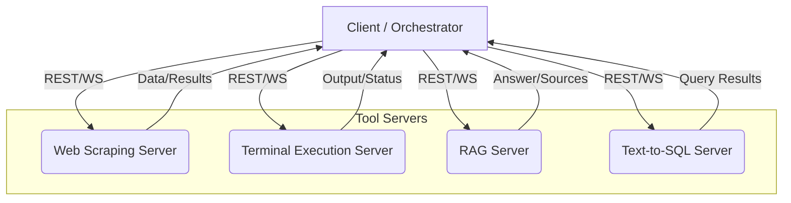

# Modular Tool Server Overview

## Introduction
This document provides a high-level overview of the four standalone tool servers designed for modular, secure, and scalable deployment within a tool orchestration ecosystem. Each server is dedicated to a specific capability—Web Scraping, Terminal Execution, Retrieval Augmented Generation (RAG), and Text-to-SQL—and exposes a well-defined API for integration with orchestrators, agents, or client applications.

## Modular Architecture
Each tool server is implemented as an independent, stateless service with its own API, security model, and deployment strategy. This modular approach enables:
- **Separation of concerns:** Each tool can be developed, deployed, and scaled independently.
- **Security isolation:** Each server enforces its own security boundaries and resource limits.
- **Extensibility:** New tools can be added without impacting existing services.
- **Orchestration:** A central orchestrator (e.g., MCP, AI Dev Agent) can route requests to the appropriate tool server based on task type.

## High-Level System Diagram

## Tool Server Summary Table
| Tool Server         | Primary Function                | API Type   | Key Technologies         | Link to Docs |
|---------------------|---------------------------------|------------|--------------------------|--------------|
| Web Scraping        | Data extraction from websites   | REST       | FastAPI, Celery, Python  | [Web Scraping](./web_scraping_server.md) |
| Terminal Execution  | Secure remote command execution | REST/WS    | Go, Docker, WebSocket    | [Terminal Execution](./terminal_execution_server.md) |
| RAG                 | Context-aware text generation   | REST       | FastAPI, LLM, Vector DB  | [RAG](./rag_server.md) |
| Text-to-SQL         | NL to SQL translation & query   | REST       | FastAPI, LLM, SQLAlchemy | [Text-to-SQL](./text_to_sql_server.md) |

## Integration and Orchestration
- **Orchestrator Role:** A central orchestrator (e.g., MCP, AI Dev Agent) receives user or agent requests, determines the required tool, and dispatches the request to the appropriate server.
- **Communication:** All servers expose HTTP REST APIs (and WebSocket for streaming where needed). Authentication is enforced per server.
- **Extensibility:** Additional tool servers can be added by following the same modular pattern.

## Security and Compliance
- Each server enforces its own authentication, authorization, and rate limiting.
- Secrets and sensitive data are managed per server, with recommended use of environment variables and secrets managers.
- Data privacy, audit logging, and compliance are addressed in each server's documentation.

## Deployment and Scaling
- Servers can be deployed independently using Docker, Kubernetes, or serverless platforms.
- Each server can be scaled horizontally based on workload.
- CI/CD pipelines and monitoring are recommended for each service.

## References
- [Web Scraping Server Documentation](./web_scraping_server.md)
- [Terminal Execution Server Documentation](./terminal_execution_server.md)
- [RAG Server Documentation](./rag_server.md)
- [Text-to-SQL Server Documentation](./text_to_sql_server.md) 