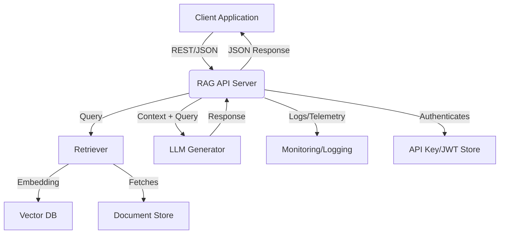

# Retrieval Augmented Generation (RAG) Server Documentation

## 1. Introduction

### 1.1. Overview of the Tool's Purpose
The RAG Server provides context-aware text generation by combining information retrieval from a knowledge base with large language model (LLM) generation. It enables users to query a corpus of documents and receive generated answers grounded in retrieved context, supporting use cases like question answering, chatbots, and knowledge assistants.

### 1.2. Purpose and Goals of its Dedicated Server Implementation
**Purpose:**
- Deliver accurate, up-to-date, and contextually relevant responses by augmenting LLMs with external knowledge.
- Serve as a modular, scalable backend for RAG-powered applications.

**Goals:**
- **Accuracy:** Ground LLM outputs in retrieved facts.
- **Scalability:** Efficiently handle large corpora and high query volumes.
- **Extensibility:** Support pluggable retrievers, vector DBs, and LLMs.
- **Observability:** Provide detailed logs, metrics, and traceability for each response.

### 1.3. Intended Audience for This Documentation
- AI/ML engineers and researchers
- Backend/API developers
- Data scientists
- Product teams building knowledge assistants

## 2. System Architecture

### 2.1. High-level Architectural Diagram (Mermaid Syntax)


### 2.2. Narrative Explaining the Server's Components, Modules, and Their Interconnections
- **API Server:** Exposes endpoints for RAG queries, document ingestion, and status. Handles authentication and request validation.
- **Retriever:** Converts queries to embeddings, searches the vector DB, and fetches top-k relevant documents.
- **Vector DB:** Stores document embeddings for fast similarity search (e.g., Pinecone, Weaviate, Qdrant, FAISS).
- **Document Store:** Holds raw documents, metadata, and chunked text.
- **LLM Generator:** Receives the query and retrieved context, constructs a prompt, and generates a grounded response using an LLM (e.g., OpenAI, HuggingFace, local model).
- **Monitoring/Logging:** Captures metrics, traces, and logs for observability.
- **API Key/JWT Store:** Manages authentication and access control.

### 2.3. Technology Stack Choices and Rationale
- **Python:** Rich ecosystem for ML, NLP, and API development.
- **FastAPI:** High-performance, async API framework.
- **Vector DB:** Pinecone, Weaviate, Qdrant, or FAISS (choose based on scale and requirements).
- **LLM:** OpenAI API, HuggingFace Transformers, or local LLMs (e.g., Llama.cpp, vLLM).
- **Embedding Model:** Sentence Transformers, OpenAI embeddings, or similar.
- **Docker:** For containerization and reproducibility.

## 3. Core Components & Logic

### 3.1. Detailed Explanation of Each Primary Module and Its Responsibilities
- **API Module:** Handles query, ingestion, and status endpoints. Validates requests and manages authentication.
- **Retriever Module:**
    - Converts queries to embeddings.
    - Searches vector DB for top-k similar documents.
    - Fetches full text and metadata from document store.
- **Embedding Module:**
    - Uses pre-trained or fine-tuned models to embed queries and documents.
- **Vector DB Client:**
    - Handles upserts, queries, and deletions in the vector DB.
- **LLM Generation Module:**
    - Constructs prompts with retrieved context and user query.
    - Calls LLM API or local model for generation.
    - Post-processes and returns the response.
- **Document Ingestion Module:**
    - Accepts new documents, splits into chunks, embeds, and stores in vector DB and document store.
- **Monitoring/Logging:**
    - Logs all queries, retrievals, generations, and errors.

### 3.2. Algorithms, Data Processing Pipelines, and Decision-Making Logic
- **Query Pipeline:**
    1. Receive query via API.
    2. Embed query.
    3. Retrieve top-k documents from vector DB.
    4. Fetch full text from document store.
    5. Construct prompt and call LLM.
    6. Return generated response and (optionally) sources.
- **Ingestion Pipeline:**
    1. Receive document via API.
    2. Split into chunks.
    3. Embed each chunk.
    4. Store embeddings in vector DB and text in document store.

### 3.3. For RAG: Vector Database Choice, Embedding Models, Retrieval Strategy, Generation Model
- **Vector DB:** Pinecone, Weaviate, Qdrant, FAISS, etc.
- **Embedding Model:** Sentence Transformers, OpenAI, Cohere, etc.
- **Retrieval Strategy:** Top-k similarity search, hybrid search (BM25 + vector), optional reranking.
- **Generation Model:** OpenAI GPT-3/4, HuggingFace LLMs, local models.

## 4. API Design

### 4.1. Detailed Specification of All API Endpoints
- **POST /query_rag**: Submit a query for RAG answer.
    - Request: `{ "query": "string", "top_k": 5, "return_sources": true }`
    - Response: `{ "answer": "string", "sources": [ ... ] }`
- **POST /ingest_document**: Add a new document to the corpus.
    - Request: `{ "text": "string", "metadata": { ... } }`
    - Response: `{ "status": "ingested", "doc_id": "string" }`
- **GET /status**: Health and status endpoint.

### 4.2. Request/Response Schemas (JSON)
- See above for examples. All data is JSON.

### 4.3. Authentication and Authorization Mechanisms
- API keys or JWTs for all endpoints.
- Optional RBAC for ingestion vs. query.

### 4.4. Rate Limiting and Throttling Strategies
- Per-user and global rate limits on queries and ingestion.
- HTTP 429 if exceeded.

### 4.5. Error Handling and Status Codes
- Standard HTTP codes: 200, 201, 202, 400, 401, 403, 404, 429, 500.
- JSON error bodies: `{ "error": "message" }`

## 5. Data Management

### 5.1. Description of Data Sources
- User queries, documents, embeddings, LLM responses.

### 5.2. Data Storage Solutions
- Vector DB for embeddings.
- Document store (PostgreSQL, MongoDB, S3, or local files) for raw text and metadata.
- Logs in file or centralized logging system.

### 5.3. Data Flow Within the Server
- Query → Embedding → Retrieval → Generation → Response
- Ingestion → Chunking → Embedding → Storage

### 5.4. Data Security, Privacy Measures, and Compliance Considerations
- All data in transit via HTTPS.
- Sensitive data (e.g., proprietary docs) encrypted at rest.
- Access controls for ingestion and query.
- Audit logs for all access.

### 5.5. Data Backup and Recovery Strategy
- Regular backups of document store and vector DB.
- Test restores periodically.

## 6. Dependencies & Prerequisites

### 6.1. Software, Libraries, SDKs, and Services
- Python 3.9+
- fastapi, uvicorn, pydantic
- sentence-transformers, openai, huggingface_hub
- pinecone-client, weaviate-client, qdrant-client, or faiss
- requests, python-dotenv
- Docker

### 6.2. System-Level Dependencies
- Linux OS
- Sufficient CPU/RAM for LLM and embedding models
- Access to vector DB and document store

### 6.3. External Services Setup
- Set up vector DB (Pinecone, Weaviate, Qdrant, or FAISS)
- (Optional) Set up LLM API keys (OpenAI, Cohere, etc.)

## 7. Step-by-Step Installation & Configuration Guide

### 7.1. Development Environment Setup
1. Install Python 3.9+ and Docker.
2. Clone the repository.
3. Copy `.env.example` to `.env` and set API keys, vector DB config, and LLM provider.
4. Run `pip install -r requirements.txt`.

### 7.2. Cloning the Repository
```bash
git clone <repo_url>
cd rag-server
```

### 7.3. Installing Dependencies
```bash
pip install -r requirements.txt
```

### 7.4. Configuration
- Edit `.env` for API keys, vector DB, LLM provider, and other settings.

### 7.5. Running the Server Locally
```bash
uvicorn main:app --reload
```

### 7.6. Initial Data Seeding
- Ingest sample documents via API or script.

## 8. Deployment Strategy

### 8.1. Production Deployment
- Use Docker Compose or Kubernetes for orchestration.
- Use environment variables or secrets manager for sensitive config.

### 8.2. Containerization
- Provide a `Dockerfile` for the server.
- Use Docker Compose to run server and vector DB (if local).

### 8.3. Orchestration
- Kubernetes Deployment and Service manifests.
- Use ConfigMaps and Secrets for configuration.

### 8.4. CI/CD Pipeline
- Lint, test, build, and push Docker image.
- Deploy to staging/production on merge.

### 8.5. Environment-Specific Configurations
- Use separate config for dev, staging, prod.

## 9. Security Considerations

### 9.1. Potential Vulnerabilities
- Prompt injection, data leakage, unauthorized access, model abuse.

### 9.2. Mitigation Strategies
- Input validation, output filtering, RBAC, audit logging, rate limiting, regular dependency updates.

### 9.3. Secure Handling of Secrets
- Use environment variables or secrets manager.
- Never log secrets.

## 10. Monitoring, Logging, & Alerting

### 10.1. Key Metrics
- Query count, error rate, latency, retrieval/generation times, resource usage.

### 10.2. Logging Practices
- Structured JSON logs, log rotation, correlation IDs.

### 10.3. Alerting
- Alert on high error rates, slow responses, failed generations.

### 10.4. Health Check Endpoint
- `GET /status` returns 200 if healthy.

## 11. Scalability & Performance

### 11.1. Scaling
- Run multiple server instances behind a load balancer.
- Scale vector DB and LLM resources as needed.

### 11.2. Performance Optimization
- Use efficient embedding models, batch queries, cache frequent results.

### 11.3. Load Testing
- Use locust, k6, or custom scripts to simulate concurrent queries.

## 12. Example Usage & Integration

### 12.1. Code Snippets
```python
import requests
headers = {"Authorization": "Bearer <token>"}
resp = requests.post("https://host/query_rag", json={"query": "What is RAG?"}, headers=headers)
print(resp.json())
```

### 12.2. Walkthrough
- Ingest a document, submit a query, receive a grounded answer with sources.

### 12.3. Integration
- Integrate with chatbots, search, or analytics tools.

## 13. Troubleshooting Guide

### 13.1. Common Problems
- Vector DB not reachable, LLM API key invalid, slow responses, empty results.

### 13.2. Debugging Tips
- Check logs, verify vector DB and LLM connectivity, test with known queries.

## 14. Future Enhancements

### 14.1. Future Directions
- Hybrid retrieval, reranking, multi-modal RAG, advanced analytics, UI dashboard.

### 14.2. Areas for Improvement
- Faster retrieval, better prompt engineering, more robust error handling, advanced access controls. 