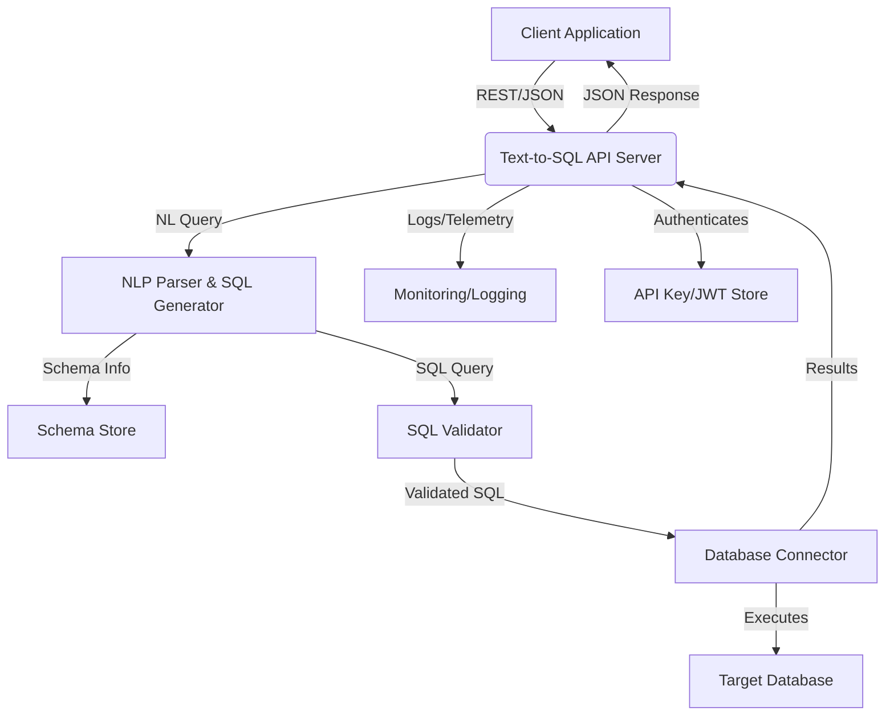

# Text-to-SQL Server Documentation

## 1. Introduction

### 1.1. Overview of the Tool's Purpose
The Text-to-SQL Server enables users to query structured databases using natural language. It translates user questions into SQL queries, executes them securely, and returns results, making data access more accessible for non-technical users and enabling analytics, reporting, and automation.

### 1.2. Purpose and Goals of its Dedicated Server Implementation
**Purpose:**
- Bridge the gap between human language and database querying.
- Provide a secure, auditable, and user-friendly interface for database access.

**Goals:**
- **Accuracy:** Generate correct, context-aware SQL for a variety of schemas.
- **Security:** Prevent SQL injection, unauthorized access, and data leakage.
- **Extensibility:** Support multiple databases, schemas, and language models.
- **Observability:** Log all queries, results, and errors for audit and debugging.

### 1.3. Intended Audience for This Documentation
- Data analysts and business users
- Backend/API developers
- Database administrators
- Product teams building analytics or BI tools

## 2. System Architecture

### 2.1. High-level Architectural Diagram (Mermaid Syntax)


### 2.2. Narrative Explaining the Server's Components, Modules, and Their Interconnections
- **API Server:** Exposes endpoints for NL-to-SQL translation and query execution. Handles authentication and request validation.
- **NLP Parser & SQL Generator:** Uses LLMs or rule-based models to parse natural language and generate SQL, considering schema and user context.
- **Schema Store:** Maintains up-to-date database schema metadata for accurate SQL generation.
- **SQL Validator:** Checks generated SQL for safety, correctness, and compliance with access policies.
- **Database Connector:** Executes validated SQL against the target database and fetches results.
- **Monitoring/Logging:** Captures metrics, traces, and logs for observability.
- **API Key/JWT Store:** Manages authentication and access control.

### 2.3. Technology Stack Choices and Rationale
- **Python:** Rich ecosystem for NLP, LLMs, and database access.
- **FastAPI:** High-performance, async API framework.
- **LLM/NLP:** OpenAI, HuggingFace Transformers, or specialized Text-to-SQL models (e.g., SQLCoder, Text2SQL).
- **SQLAlchemy:** For safe, multi-database connectivity.
- **Docker:** For containerization and reproducibility.

## 3. Core Components & Logic

### 3.1. Detailed Explanation of Each Primary Module and Its Responsibilities
- **API Module:** Handles translation and execution endpoints, validates requests, manages authentication.
- **NLP Parser & SQL Generator:**
    - Parses NL queries, maps to schema, generates SQL using LLM or template-based approaches.
- **Schema Store:**
    - Loads and caches schema metadata from target databases.
- **SQL Validator:**
    - Checks for SQL injection, forbidden operations, and compliance with access policies.
    - Optionally uses static analysis or query whitelisting.
- **Database Connector:**
    - Executes validated SQL, fetches results, handles errors and timeouts.
- **Monitoring/Logging:**
    - Logs all queries, SQL, results, and errors.

### 3.2. Algorithms, Data Processing Pipelines, and Decision-Making Logic
- **Query Pipeline:**
    1. Receive NL query via API.
    2. Parse and embed query.
    3. Retrieve schema info.
    4. Generate SQL using LLM or rules.
    5. Validate SQL for safety and correctness.
    6. Execute SQL and fetch results.
    7. Return results and (optionally) generated SQL.

### 3.4. For Text-to-SQL: NLP Parsing, Schema Mapping, SQL Generation Logic, Query Validation
- **NLP Parsing:** Use LLMs or fine-tuned models to understand intent and entities.
- **Schema Mapping:** Map NL terms to tables, columns, and relationships using schema metadata.
- **SQL Generation:** Generate SQL using prompt engineering, templates, or model outputs.
- **Query Validation:** Check for forbidden keywords, subqueries, or dangerous operations. Enforce row/column-level security.

## 4. API Design

### 4.1. Detailed Specification of All API Endpoints
- **POST /text_to_sql**: Submit a NL query for translation and execution.
    - Request: `{ "query": "string", "db_id": "string", "return_sql": true }`
    - Response: `{ "result": [ ... ], "sql": "..." }`
- **GET /schema/{db_id}**: Get schema metadata for a database.
    - Response: `{ "tables": [ ... ], "columns": [ ... ] }`
- **GET /status**: Health and status endpoint.

### 4.2. Request/Response Schemas (JSON)
- See above for examples. All data is JSON.

### 4.3. Authentication and Authorization Mechanisms
- API keys or JWTs for all endpoints.
- Optional RBAC for database access.

### 4.4. Rate Limiting and Throttling Strategies
- Per-user and global rate limits on queries.
- HTTP 429 if exceeded.

### 4.5. Error Handling and Status Codes
- Standard HTTP codes: 200, 201, 202, 400, 401, 403, 404, 429, 500.
- JSON error bodies: `{ "error": "message" }`

## 5. Data Management

### 5.1. Description of Data Sources
- User queries, generated SQL, query results, schema metadata.

### 5.2. Data Storage Solutions
- In-memory or persistent store for schema metadata.
- Logs in file or centralized logging system.
- No persistent storage of query results unless configured.

### 5.3. Data Flow Within the Server
- NL Query → Parsing → SQL Generation → Validation → Execution → Response

### 5.4. Data Security, Privacy Measures, and Compliance Considerations
- All data in transit via HTTPS.
- No sensitive data logged.
- Access controls for database and schema.
- Audit logs for all access.

### 5.5. Data Backup and Recovery Strategy
- Regular backups of schema metadata (if persistent).
- Test restores periodically.

## 6. Dependencies & Prerequisites

### 6.1. Software, Libraries, SDKs, and Services
- Python 3.9+
- fastapi, uvicorn, pydantic
- openai, huggingface_hub, or text2sql models
- sqlalchemy, databases, asyncpg, psycopg2, pymysql, etc.
- requests, python-dotenv
- Docker

### 6.2. System-Level Dependencies
- Linux OS
- Sufficient CPU/RAM for LLM and database connections
- Access to target databases

### 6.3. External Services Setup
- Set up target databases (PostgreSQL, MySQL, etc.)
- (Optional) Set up LLM API keys (OpenAI, Cohere, etc.)

## 7. Step-by-Step Installation & Configuration Guide

### 7.1. Development Environment Setup
1. Install Python 3.9+ and Docker.
2. Clone the repository.
3. Copy `.env.example` to `.env` and set API keys, DB config, and LLM provider.
4. Run `pip install -r requirements.txt`.

### 7.2. Cloning the Repository
```bash
git clone <repo_url>
cd text-to-sql-server
```

### 7.3. Installing Dependencies
```bash
pip install -r requirements.txt
```

### 7.4. Configuration
- Edit `.env` for API keys, DB config, LLM provider, and other settings.

### 7.5. Running the Server Locally
```bash
uvicorn main:app --reload
```

### 7.6. Initial Data Seeding
- Load schema metadata from target databases.

## 8. Deployment Strategy

### 8.1. Production Deployment
- Use Docker Compose or Kubernetes for orchestration.
- Use environment variables or secrets manager for sensitive config.

### 8.2. Containerization
- Provide a `Dockerfile` for the server.
- Use Docker Compose to run server and (optionally) test DBs.

### 8.3. Orchestration
- Kubernetes Deployment and Service manifests.
- Use ConfigMaps and Secrets for configuration.

### 8.4. CI/CD Pipeline
- Lint, test, build, and push Docker image.
- Deploy to staging/production on merge.

### 8.5. Environment-Specific Configurations
- Use separate config for dev, staging, prod.

## 9. Security Considerations

### 9.1. Potential Vulnerabilities
- SQL injection, privilege escalation, data leakage, unauthorized access.

### 9.2. Mitigation Strategies
- Strict SQL validation, parameterized queries, RBAC, audit logging, rate limiting, regular dependency updates.

### 9.3. Secure Handling of Secrets
- Use environment variables or secrets manager.
- Never log secrets or sensitive query results.

## 10. Monitoring, Logging, & Alerting

### 10.1. Key Metrics
- Query count, error rate, latency, SQL generation/validation times, resource usage.

### 10.2. Logging Practices
- Structured JSON logs, log rotation, correlation IDs.

### 10.3. Alerting
- Alert on high error rates, failed queries, slow responses.

### 10.4. Health Check Endpoint
- `GET /status` returns 200 if healthy.

## 11. Scalability & Performance

### 11.1. Scaling
- Run multiple server instances behind a load balancer.
- Scale DB and LLM resources as needed.

### 11.2. Performance Optimization
- Cache schema metadata, batch queries, optimize prompt engineering.

### 11.3. Load Testing
- Use locust, k6, or custom scripts to simulate concurrent queries.

## 12. Example Usage & Integration

### 12.1. Code Snippets
```python
import requests
headers = {"Authorization": "Bearer <token>"}
resp = requests.post("https://host/text_to_sql", json={"query": "Show me all users who signed up last week", "db_id": "main"}, headers=headers)
print(resp.json())
```

### 12.2. Walkthrough
- Submit a NL query, receive results and (optionally) the generated SQL.

### 12.3. Integration
- Integrate with BI tools, dashboards, or analytics platforms.

## 13. Troubleshooting Guide

### 13.1. Common Problems
- DB not reachable, LLM API key invalid, SQL validation failed, empty results.

### 13.2. Debugging Tips
- Check logs, verify DB and LLM connectivity, test with known queries, inspect generated SQL.

## 14. Future Enhancements

### 14.1. Future Directions
- Support for more DBs, advanced NL understanding, query explanation, user feedback loop, UI dashboard.

### 14.2. Areas for Improvement
- More robust SQL validation, better error reporting, advanced access controls, improved prompt engineering. 